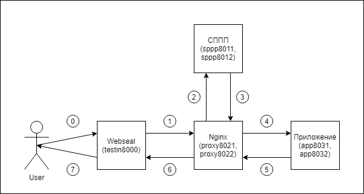
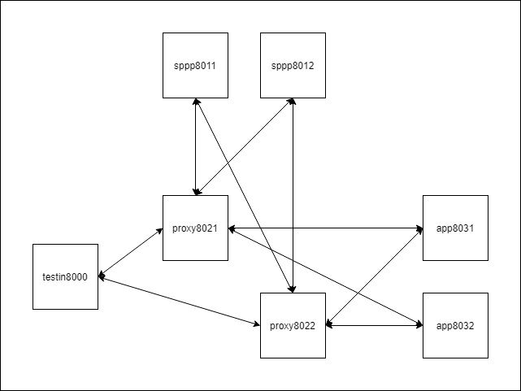

# Тестовый стенд отказоустойчивого сервиса проверки прав пользователей (Авторизации)

## Цель

* Демонстрация построения отказоустойчивой системы.
* Проверка поведения системы при разных случаях отказа компонент.
* Отладка и тестирование конфигурационных файлов для Nginx.
* Тестовый стенд для разработчиков приложений и компонентов элементов этого сервиса.

## Введение
* Идентификация - распознание, установление тождественности неизвестного объекта известному на основании совпадения признаков.
* Аутентификация - прохождение проверки подлинности.
* Авторизация - предоставление и проверка прав на совершение каких-либо действий в системе
### Принципиальная схема

 

* Запрос от браузера пользователя (0) поступает в некоторую централизованную систему доступа,
 в нашем случае она обозначена на схеме как `Webseal`. В ней происходит идентификация и аутентификация пользователей.
* Далее запрос (1) передается на прикладной прокси сервер (на схеме `Nginx`). В запрос сервер `Webseal` добавляет 
HTTP-заголовк `iv-user` с логином (идентификатором) аутентифицированного пользователя.
* Для каждого поступившего на `Nginx` запроса выполняется подзапрос к Сервису проверки прав пользователя (СППП) с целью 
определения прав пользователя на конкретные действия. В этом подзапросе (2) передаются заголовки `iv-user`, `iv-method` и 
сам `URI` от исходного запроса. Тело исходного запроса не передаётся. Даже с учетом использования спецификации 
RESTful API этих данных достаточно что-бы определить права пользователя на поступивший запрос (1).
* На подзапрос (2) СППП формирует ответ важным в котором является только HTTP-статус. Статус в диапазоне от 200 до 299 
считается разрешающем доступ и `Nginx` пересылает запрос (4) далее к серверу приложений.
 При других статусах ответа от СППП сервер `Nginx` отвечает пользователю отказом или ошибкой.

### Преимущества
* Отказоустойчивость системы в целом.
* Масштабируемость под любые нагрузки и задачи.
* Простота реализации каждой компоненты (микросервисный подход).
* Кросс-платформенность. Независимость реализации компонент от ОС и/или языка программирования. 
* К приложению не приходят лишние запросы (зашита от DDoS-атак).
* Специфика аутентификационных запросов позволяет их эффективно кешировать, снижая нагрузку на сеть.
* В случе несогласования настроек пользователь не получит доступ, но это лучше чем получит.
* Отделённая от приложения правовая система.
* Вместо приложений таким способом можно ограничить доступ к частям статического контента. 
* Используются штатная логика сервера `Nginx` (директива `auth_request` широко используется для различных типов аутентификаций).

### Недостатки
* Неатомарность
    * Рассредоточенность компонент и как следствие возможны ошибки некорректной настройки.
    * При изменениях в структуре приложения возможно потребуются изменения в других компонентах.

### Компонентная схема стенда.

 

Стенд состоит из семи компонент каждый из которых реализованных на своём экземпляре сервера Nginx.
Конфигурацию управления стенда и порядок запуска компонент можно варьировать изменяя список компонент
в командном файле `all.cmd`. Например, перед ненужными компонентами можно ставить `-` или любые другие символы. 
Цифры в названиях компонент соответствуют номерам портов на которых они принимают запросы.

### Описание компонент
* `app8031` и `app8032` - Аналоги приложений, на любой запрос отвечающие HTML-таблицой с параметрами запроса пришедшего на них. 
* `sppp8011` и `sppp8012` - Простая реализация СППП на конфигурационных файлах Nginx. Права пользователей хранятся в 
файлах `sppp801*\conf\*.right` где каждая строка определяет один доступ для каждого пользователя 
к каждому типу запроса (GET, POST, DELETE, ...) к одному ресурсу (URI). 
Например, строка `USER|GET|/aaa/bbb 1;` означает - пользователю `USER` доступ на выполнение запросов типа `GET` 
к документу `/aaa/bbb`  разрешен `1`. После изменения этих файлов как и файла конфигурации `nginx.conf` требуется 
перечитывание параметров (команда `nginx -s reload`). 
* `proxy8021` и `proxy8022` - реализация реверсивного прокси сервера. 
* `testin8000` - компонент эмитирующий `Webseal` (функции балансировки и установку HTTP-заголовка `iv-user`) 
и облегчающий формирование запросов через браузер. Запрос вида `http://localhost:8000/USER@aaa/bbb?ccc` 
преобразуется им (c добавлением заголовка `iv-user: USER`) в `http://localhost:8021/aaa/bbb?ccc` 
или `http://localhost:8022/aaa/bbb?ccc` в зависимости от алгоритма балансировки. 

## Настройка для ОС Windows
 Для работы следующие условия:
* ОС Windows 7+.
* Доступ с демомтрируемого компютера в Интернет.
* Наличие установленного ПО Docker Desktop for Windows.

## Описание коммандных файлов

* `1.all-up.cmd` - Стартует все сборку всех образов и контейнеров.
* `2.all-test.cmd` - Исполняет все тесты.
* `test\loop-test-testin8000.cmd` - Циклически запускает тест с запросами на вход "кластера".
* `3.all-clean.cmd` - Принудительное удаление созданных в Docker образов и контэйнеров.

### Используемые ресурсы
* Статья натолкнувшая на идею использования штатной директивы `auth_request` для сервера `Nginx` [https://www.nginx.com/blog/validating-oauth-2-0-access-tokens-nginx/]
* Простой [онлайн редактор блок-схем](http://primat.org/index/redaktor_blok_skhem/0-130) для рисования схем.
* Инструкция по Docker Compose [https://docs.docker.com/compose/]
